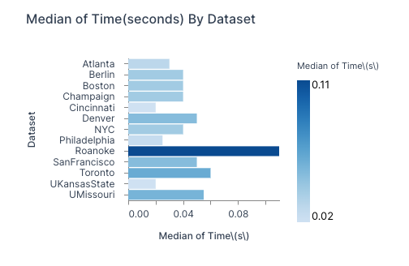
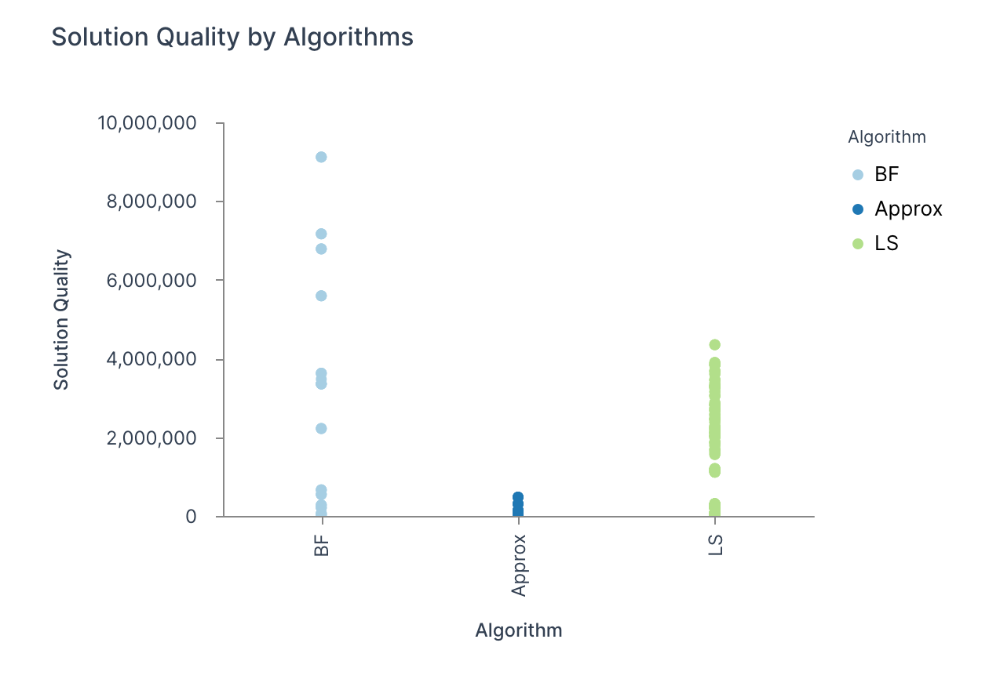

# CSE6140-Final-Project Report
GitHub Repository: [taraliu23/CSE6140-Final-Project](https://github.com/taraliu23/CSE6140-Final-Project)

Group Member: [Tingyu Liu](tliu479@gatech.edu)


## Project Objectives

Solve TSP (Traveling Salesman Problem) with three different algorithms and evaluate running times and performances.

## Problem: TSP

Given x-y coordinates of N points in the plane, find the shortest simple cycle that visit all N points.

In graph G:

- Vertices: N points
- Edges: travel route
- Weight: Euclidean distance
- Direction: Undirected, and all edges costs are symmetric

## Description of Algorithms

#### 1. **Exact**: brute-force with a time cut-off. 
- end time T=300s, then exit
- output: solution found so far

The Brute Force algorithm calculates all the city permutations and returns the optimal tour and cost. 

Time complexity: $O(n!)$

#### 2. **Approximate**: 2-approximation algorithm
- guarantee quality
- based on MST (Minimum Spanning Tree)

The Approximate MST algorithm is a 2-approximation algorithm. It constructs a Minimum Spanning Tree (MST) and performs a depth-first search.
Time complexity: $O(n^2 logn)$

Algorithm steps:
	- compute distance matrix	
	- construct MST with Kruskal's algorithm
	- List visited  cities in the preorder walk of the MST and add one at the end

#### **Local Search**: heuristic algorithm


Simulated Annealing is a local search algorithm and can achieve near-optimal results.

	Algorithm steps: 
	1. init with a random travel, temperature, and cooling rate.
	2. while the temperature is higher than the limit:
		swap two cities and generate travel, calculate the cost
		accept new state
		update the local optimal travel
		decrease the temperature with the cooling rate
	3. return the local optimum

## Performance Table


A total of 472 TSP instances were computed, and the table shows the aggregated average time, solution quality, and relative error for each algorithm and dataset.

 *Additionally: The `full_tour` column is averaged over all runs. If the value is greater than 0.5, the algorithm consistently produces valid tours for the dataset and is marked as `TRUE` in this table. Otherwise, it is marked as `FALSE`.*

## Analysis and Visualization

#### Result Dataset Description
<p float="left">
  
   
</p>

- **Observation**:
    - Most datasets have median execution times under 0.05 seconds.
    - Roanoke, the dataset with the largest number of points, have highest median times.
- **Insights**:
    - MST Approximation and Local Search with simulated annealing shows efficiency across datasets.
    - Brute Force algorithm dominates the runtime for larger datasets.

#### Solution Quality

<p float="left">
  
   
</p>


- **Observation**:
    - Brute Force has the best quality across datasets, and MST Approximation has the lowest quality.
    - Local Search has intermediate-quality solutions with some variability
- **Insights:**
    - MST Approximation sacrifices solution quality for speed.
    - Local Search returns near-optimal solutions, and it balances speed and quality.

#### Computation Time

<p float="left">
  
   
</p>


- **Observation**:
    - Brute Force has the best quality across datasets, and MST Approximation has the lowest quality.
    - Local Search has intermediate-quality solutions with some variability
- **Insights:**
    - MST Approximation sacrifices solution quality for speed.
    - Local Search returns near-optimal solutions, and it balances speed and quality.


## Programming Style
1. Include a top comment that explains what the given file does.

2. Be well-commented and self-explanatory.

3. Create an executable from code `exec.py`
	- Any run of executable with the three or four inputs (filename, cut-off time,method, and if applicable based on method, seed) must produce an output file in the current working directory.

4. Output format: 
	- name: `⟨instance⟩ ⟨method⟩ ⟨cutof f ⟩ [⟨random seed⟩].sol`
	- file: 
		line 1: `float`, quality of best solution found
		line 2: list of vertex iDs for the TSP tour, comma-separated

## Deliverables

1. `report.pdf`
2. `results.csv`(corresponding to the table in pdf 1)
3. `{name}.zip`/
	- `code/` *contain all code and exec*
	- `output/`
	- `evaluation.txt` score 1-10 and justification

## Run this project in your machine
`gh repo clone taraliu23/CSE6140-Final-Project`

`pip install -r requirements.txt` or `pip install scipy==1.14.1` (Only this external library is needed. It's for MST calculation :) )

`cd code/`

Then you can run exec.py happily!

example input: `python exec.py -inst input/Atlanta.tsp -alg Approx -time 10 -seed 1`

and you will get:
```
start exec...
algorithm: 2-Approximation with MST
Cost: 305974.47
Tour: [0, 1, 2, 16, 6, 0]
Elapsed time: 0.00 seconds
Full tour: No
Relative error: 0.00%
Results saved to output/Atlanta_Approx_10_1.sol
Log saved to output/timing_log.txt
end exec...

```

## Reference

[1]GeeksforGeeks, “Approximate solution for Travelling Salesman Problem using MST,” GeeksforGeeks, Nov. 04, 2013. Accessed: Dec. 02, 2024. [Online]. Available: https://www.geeksforgeeks.org/approximate-solution-for-travelling-salesman-problem-using-mst/

[2]“minimum_spanning_tree — SciPy v1.14.1 Manual.” Accessed: Dec. 02, 2024. [Online]. Available: https://docs.scipy.org/doc/scipy/reference/generated/scipy.sparse.csgraph.minimum_spanning_tree.html